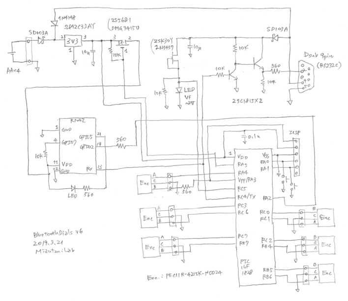
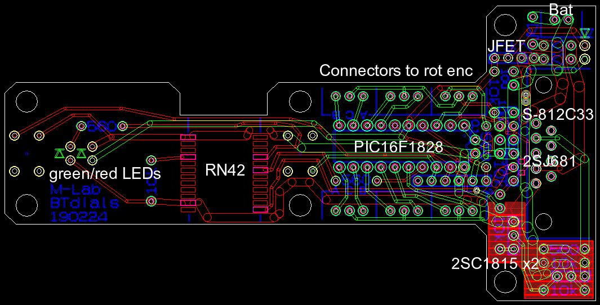
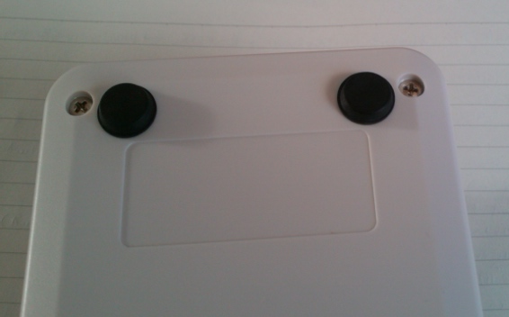
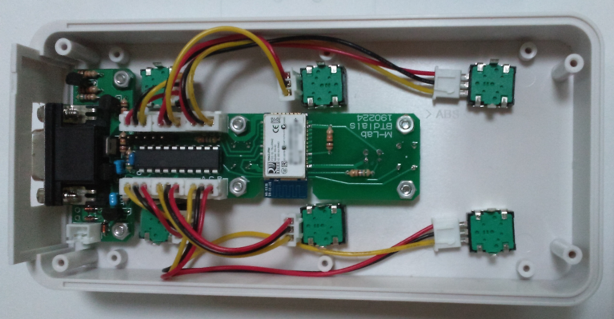
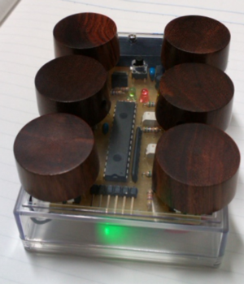
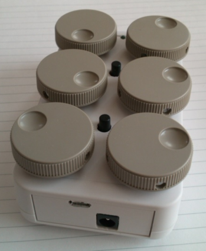

# Bluetooth Dials

 

Bluetooth Dials is a wireless input device for operating multiple parameters with dials and buttons. We use this device to rotate 3D structures, move them along the x/y/z axes, adjust the contrast and brightness, zoom in/out, move movie frames forward/backward, and so on. It has dials and buttons and sends your operation through its Bluetooth interface or serial connector to your PC. In 1990's, dial/button boxes were commercially available from graphics workstation manufacturers, but today we can't find such devices. The most similar one is Microsoft Surface Dial, but it has only one dial and does not meet our needs. Bluetooth Dials is a wireless version of the historic dial/button box. It's compatible with our <a href="https://github.com/mizutanilab/RecView">RecView</a> and <a href="https://github.com/mizutanilab/MCTrace">MCTrace</a> softwares. We usually use a mouse with the right hand and this device with the left hand to operate our softwares. 

Six knobs are used for changing parameters. Two buttons are used for toggling some functions. The lower button is also used for turning on and off the device. The green LED blinks when the Bluetooth interface is ready, or turns on when the link is established. The red LED indicates the RS232C connection.  

The Bluetooth interface of this device is RN42 (Roving Networks / Microchip). For the host-side interface, we use dongles MM-BTUD43 (Sanwa Supply) for Windows PCs. This dongle seems to use a CSR chip. Built-in Bluetooth interfaces of most of our laptop PCs also work well with the device.  

## Firmware
Dial/button operations are sent to a virtual COM port associated with this device. If the device is paired with your PC, the device port is listed in the Dialbox dialog of RecView and MCTrace. The COM port number can also be found from: Bluetooth icon in the lower right -> show devices -> other options -> COM port tab.  

In the default boot, Bluetooth sniffing with a 500 ms interval is enabled (RN42 command: SW,0320) to reduce the battery consumption, but a certain laptop seems not compatible with sniffing. The sniffing is disabled by pressing the lower button while setting batteries.  

The original firmware had two modes: serial mode and keyboard mode, though the present release only runs in the serial mode for simplicity. The keyboard mode of the original firmware was enabled by pressing the upper button while setting batteries. In the keyboard mode (though it's not available), the device was recognized as a Bluetooth keyboard. Dial/button operations were treated as if they are keyboard inputs.  

## Schematic
 
There's nothing special. The MCU (PIC16F1828) receives signals from rotary encoders (PEC11R, Bourns) and push buttons (B3F, Omron), and sends those information through the UART TX line to the Bluetooth module (RN42) and to the RS232C interface. The device operates with four AA batteries, or with DC current draw from the RS232C DTR line. The D-sub port can be connected to an RS232C interface of your PC with a stragiht cable, or to a USB port using an RS232C-USB adaptor.  

## PCB gerbers
 
Gerber files are available in the 'gerber' folder.  

## Host side coding
The device encodes dial/button operations into ASCII characters Z/X (CCW/CW of the lower left dial), A/S (middle left), Q/W (upper left), C/V (lower right), D/F (middle right), E/R (upper right), G (lower button), and T (upper button) and transmits them through the Bluetooth interface and to the RS232C connector. These character codes can be processed with host-side application. Please find a code example in files <a href="https://github.com/mizutanilab/RecView/blob/master/source/DlgDialbox.cpp">DlgDialbox.cpp</a> and <a href="https://github.com/mizutanilab/RecView/blob/master/source/MainFrm.cpp">MainFrm.cpp</a> of <a href="https://github.com/mizutanilab/RecView">RecView</a>.

In the Bluetooth keyboard mode of the original version, the input characters come through as keyboard inputs, so they can be used as accelerator keys. By associating these characters with target routines, software functions are invoked by the dial/button operations. 

## Tips
Rubber bumpons on the device back are essential. Without these bumpons, the device itself rotates when you rotate knobs. We recommend SJ-5312 bumpons of 3M.  
 

We use connector cables to wire rotary encoders. This is because the encoders often go wrong when we use the device on a daily basis, so we have to replace them on the spot. There would be other workarounds but this seems easiest and cheapest.  
 

## Variations
A portable model with a battery charging circuit. Its size is about 95 x 65 x 35 mm. It's equipped with wood knobs for the better usability. We purchased them as guitar knobs.   
  
A dual interface model dedicated to one of our laptop PCs. The Bluetooth interface of that PC is troublesome, so the USB is rather straightforward. It's equipped with both of Bluetooth and USB interfaces. The micro USB connector is internally wired to a FT234XD chip, which is then connected to the MCU.  
 
