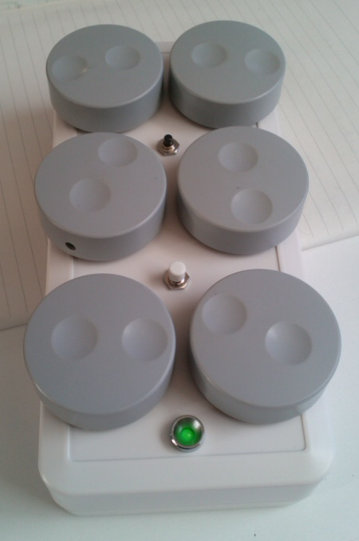
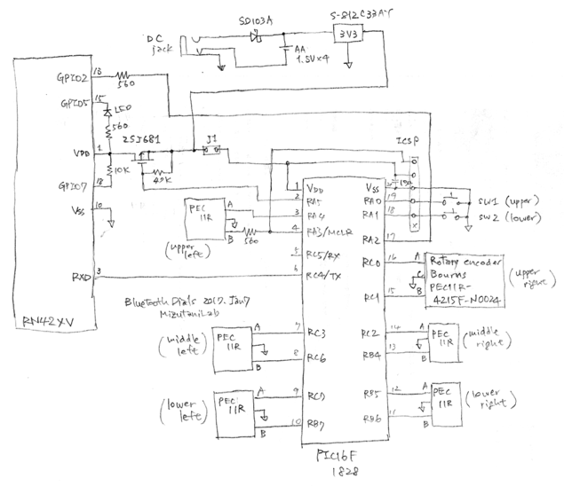

# Bluetooth Dials

 

Bluetooth Dials is a wireless input device for operating multiple parameters with dials and buttons. We use this device to rotate 3D structures, move them along the x/y/z axes, adjust the contrast and brightness, zoom in/out, move movie frames forward/backward, and so on. It has dials and buttons and sends your operation through its Bluetooth interface to your PC or WS. In 1990's, dial/button boxes were commercially available from graphics WS manufacturers, but today we can't find such devices. The most similar one is Microsoft Surface Dial, but it has only one dial and does not meet our needs. Bluetooth Dials is a wireless version of the historic dial/button box. It's compatible with our <a href="https://github.com/mizutanilab/RecView">RecView</a> and <a href="https://github.com/mizutanilab/MCTrace">MCTrace</a> softwares. We usually use a mouse with the right hand and this device with the left hand to operate our softwares. 

Six knobs are used for changing parameters. Two buttons are used for toggling some functions. The upper button is also used for turning on and off the device. The green LED indicates the device status including the Bluetooth connection.  

The Bluetooth interface of this device is RN42 (Microchip / Roving Networks). For the host-side interface, we use dongles MM-BTUD43 (Sanwa Supply) for Windows 7 and 10 PCs. This dongle seems to use a CSR chip. Built-in Bluetooth interfaces of most of our laptop PCs also work well with the device. We have no information about what kind of chips are implemented in our laptops.  

## Firmware
The device firmware runs in two modes: serial mode and keyboard mode. The serial mode is the default boot. In this mode, dial/button operations are sent to a virtual COM port associated with this device. If the device is paired with your PC, the device port is scanned and listed automatically in the Dialbox dialog of RecView and MCTrace. The COM port number can also be found from: Bluetooth icon in the lower right -> show devices -> other options -> COM port tab.  

The keyboard mode is enabled by pressing the upper button while setting batteries or connecting power cable. This mode can only be used if the device is connected with the Bluetooth interface. In the keyboard mode, the device is recognized as a Bluetooth keyboard. Dial/button operations are treated as if they are keyboard inputs.  

In the serial mode, Bluetooth sniffing with a 500 ms interval is enabled (RN42 command: SW,0320) to reduce the battery consumption, but a certain laptop seems not compatible with the sniffing. In the keyboard mode, sniffing is disabled because the device reaction becomes frustrating.  

## Schematic
 
There's nothing special. The MCU (PIC16F1828) receives signals from rotary encoders (PEC11R, Bourns) and push buttons, and sends those information through the UART TX line to the Bluetooth module (RN42XV). The device operates with four AA batteries, or with an external DC supply (4 - 16 V, 50 mA). If you prefer wired connection, the UART output can be directly sent to a serial (RS232C) port of your PC. The smaller model shown above operates with three AAA batteries and is equipped with a UART-USB interface (FT234XD) to connect the device to a USB port. 

## Host side coding
The device encodes dial/button operations into ASCII characters Z/X (CCW/CW of the lower left dial), A/S (middle left), Q/W (upper left), C/V (lower right), D/F (middle right), E/R (upper right), G (lower button), and T (upper button) and transmits them through the Bluetooth interface. In the keyboard mode, these characters come through as keyboard inputs, so they can be used as accelerator keys. By associating these characters with target routines, software functions are invoked by the dial/button operations. 

If you use this device in the serial mode, dedicated host side coding is necessary, but its response is faster, while the current consumption is rather low.  

Please find a code example in files <a href="https://github.com/mizutanilab/RecView/blob/master/source/DlgDialbox.cpp">DlgDialbox.cpp</a> and <a href="https://github.com/mizutanilab/RecView/blob/master/source/MainFrm.cpp">MainFrm.cpp</a> of <a href="https://github.com/mizutanilab/RecView">RecView</a>.

## Tips
Rubber bumpons on the device back are essential. Without these bumpons, the device itself rotates when you rotate knobs.  
 

## Variations
A portable model with a battery charging circuit. Its size is about 95 x 65 x 35 mm. Wood knobs are for the better usability. We purchased them as guitar knobs.   
  
A dual interface model dedicated for one of our laptop PCs. The Bluetooth interface of that PC is troublesome, so the USB is rather straightforward. It's equipped with both of Bluetooth and USB interfaces. The micro USB connector is wired to a FT234XD chip and then to the UART TX line of the MCU.  
 
